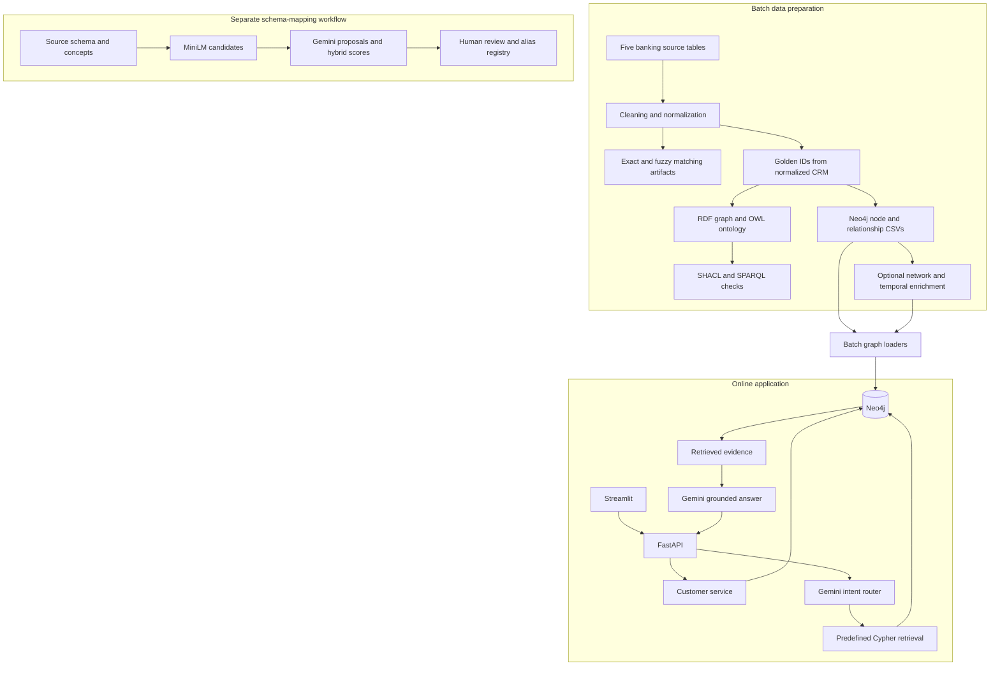
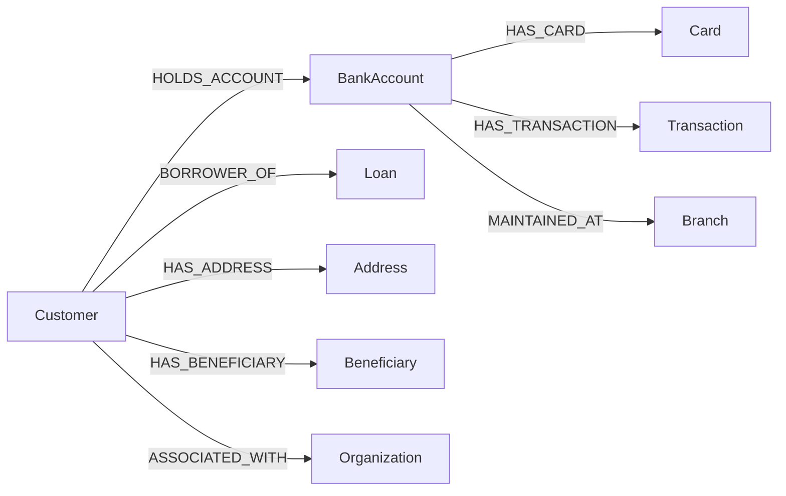
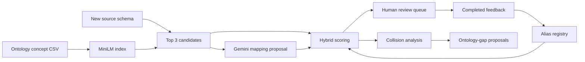
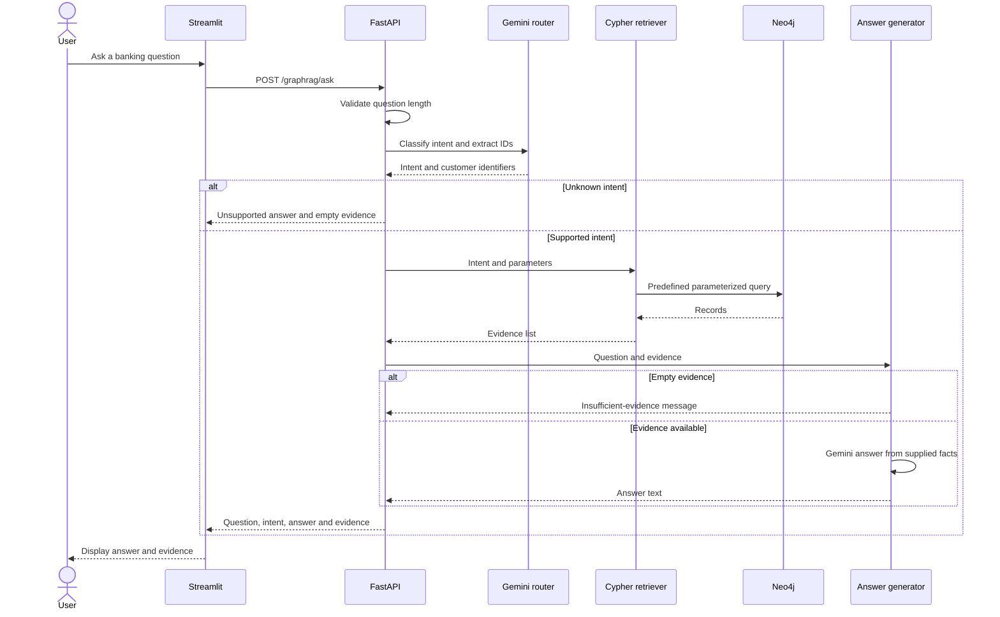

# Banking Knowledge Graph & GraphRAG

**Customer 360, semantic data quality, and evidence-grounded banking questions—from source records to a connected graph.**

[](https://github.com/eixilmayur-create/banking-knowledge-graph/actions/workflows/checks.yml)

**Python · pandas · RDF/OWL · SHACL · SPARQL · Neo4j · Gemini / Vertex AI · FastAPI · Streamlit**

This project explores how fragmented banking records can be cleaned, linked, modeled, validated and queried through a natural-language interface. It includes three workflows: batch banking-data preparation, schema mapping with human review, and a live Customer 360 / GraphRAG application.

## Contents

- [Business problem and capabilities](#business-problem-and-capabilities)
- [System architecture](#system-architecture)
- [Data sources and identity](#data-sources-and-identity)
- [Workflow 1: data preparation and validation](#workflow-1-data-preparation-and-validation)
- [Graph model and enrichment](#graph-model-and-enrichment)
- [Workflow 2: semantic mapping and review](#workflow-2-semantic-mapping-and-review)
- [Workflow 3: GraphRAG requests](#workflow-3-graphrag-requests)
- [Application and API](#application-and-api)
- [Setup and execution](#setup-and-execution)
- [Repository guide](#repository-guide)
- [Validation and troubleshooting](#validation-and-troubleshooting)
- [Tradeoffs and next steps](#tradeoffs-and-next-steps)
- [Interview walkthrough](#interview-walkthrough)

[Architecture deep dive](docs/ARCHITECTURE.md) · [Workflow runbook](docs/WORKFLOWS.md) · [Interview guide](docs/INTERVIEW_GUIDE.md) · [Demo](docs/DEMO.md) · [Validation](docs/VALIDATION.md) · [Security](SECURITY.md)

## Business problem and capabilities

Customer information is distributed across CRM, core banking, card, loan and payment systems. Each source has its own fields and identifiers. Answering “Which products does this customer hold?” requires consistent identity, understandable relationships and trustworthy data.

| Business question | Capability | Implementation |
| --- | --- | --- |
| Which records may describe the same customer? | Normalization, exact signals, fuzzy scoring and review decisions | [Entity resolution](src/entity_resolution/) |
| Do records follow the banking model? | RDF/OWL vocabulary, SHACL constraints and SPARQL checks | [Ontology](ontology/banking_ontology.ttl), [shapes](shapes/banking_shapes.ttl) |
| Which products belong to a customer? | Connected Customer 360 graph and API | [Customer service](src/api/customer_service.py) |
| Which customers share addresses or beneficiaries? | Synthetic network entities and traversal | [Network preparation](src/neo4j/create_network_entities.py) |
| What does an unfamiliar source field mean? | Embedding candidates, Gemini suggestions and review | [Semantic mapping](src/embeddings/) |
| Can an answer include inspectable evidence? | Intent routing, predefined Cypher and grounded generation | [GraphRAG](src/graphrag/) |

Shared graph connections are structural facts in synthetic data. They do not establish fraud or wrongdoing.

## System architecture

The system has a **batch preparation path** and an **online request path**. CSV artifacts connect individual scripts; the current implementation has no background scheduler or message broker.



Golden-customer creation does **not** consume match decisions. RDF validation is **not an automatic gate** on Neo4j loading. Both distinctions matter when explaining the implementation.

| Layer | Inputs | Responsibility | Outputs |
| --- | --- | --- | --- |
| Profiling | Raw CSVs | Field profiles and quality inspection | Developer reports |
| Cleaning | Five banking tables | Normalize text, categories, dates and identifiers | `data/processed/` |
| Identity experiments | Normalized CRM and external records | Exact signals, city-blocked fuzzy candidates and decisions | `outputs/entity_resolution/` |
| Semantic graph | Golden customers and cleaned records | Typed RDF, constraints and quality queries | Turtle graph and validation reports |
| Operational graph | Golden customers and cleaned records | Prepare, load and enrich Neo4j | Product/network traversals |
| Schema mapping | Concept catalog and source schema | Propose and review field meanings | Candidates, feedback, aliases and gap proposals |
| Application | Neo4j and Gemini | Customer endpoints and evidence-backed answers | JSON responses and Streamlit pages |

### Why RDF and Neo4j?

RDF/OWL describes vocabulary and meaning; SHACL validates explicit shapes. Neo4j serves application-facing product and network traversals. They are **independent materializations**, not synchronized databases. Changes require rerunning preparation and loading. RDF properties such as `linkedCard` and Neo4j relationships such as `HAS_CARD` have different names; conversion code defines the correspondence.

## Data sources and identity

The [manifest](data/raw/dataset_manifest.json) identifies the base tables as synthetic.

| File | Rows | Key / link | Role |
| --- | ---: | --- | --- |
| `crm_customers.csv` | 4,000 | `crm_customer_id` | Identity, location, KYC and risk segment |
| `core_accounts.csv` | 5,000 | `account_id`, `customer_ref` | Ownership, status, branch and balance |
| `card_accounts.csv` | 3,000 | `card_id`, `linked_account_id` | Cards linked to accounts |
| `loan_accounts.csv` | 2,000 | `loan_id`, `borrower_customer_ref` | Borrower, principal, rate and status |
| `transactions.csv` | 6,000 | `transaction_id`, `account_id` | Activity, amount, direction and channel |
| **Base total** | **20,000** | | Excludes derived experiments |

`new_source_schema.csv` contains 15 field descriptions for mapping experiments. External-customer generation samples 1,500 cleaned CRM records and introduces variations; these are derived records, not another real customer population.

The public edition replaces names, emails, phones, birth dates and identity fields with conspicuous demo values. Emails use `example.invalid`. These substitutions affect matching behavior; results are not evidence of real-world accuracy.

Golden IDs have the form `GC0000001`. The script sorts by `crm_customer_id` and assigns sequential IDs. IDs reproduce for the same ordered input, but inserting/removing earlier rows can shift them. This is not a persistent master-ID service.

## Workflow 1: data preparation and validation

[The offline runner](scripts/run_offline.py) executes ten steps in order. Each subprocess must complete before the next starts.

| Step | Script under `src/` | Processing | Main artifact |
| --- | --- | --- | --- |
| 1 | `cleaning/clean_sources.py` | Clean five source tables | `data/processed/*_clean.csv` |
| 2 | `entity_resolution/create_external_customer_source.py` | Perturb external records and preserve truth | External source and ground-truth CSVs |
| 3 | `entity_resolution/normalize_entities.py` | Prepare comparable fields | CRM/external `*_er_ready.csv` |
| 4 | `entity_resolution/deterministic_match.py` | Pick strongest exact candidate | `deterministic_matches.csv` |
| 5 | `entity_resolution/fuzzy_match.py` | Compare same-city candidates | `fuzzy_matches.csv` |
| 6 | `entity_resolution/resolution_decision.py` | MATCH / REVIEW / NO_MATCH | `entity_resolution_decisions.csv` |
| 7 | `entity_resolution/create_golden_customers.py` | Assign IDs to normalized CRM | `golden_customers.csv` |
| 8 | `rdf/csv_to_rdf.py` | Materialize RDF entities and links | `outputs/rdf/banking_knowledge_graph.ttl` |
| 9 | `validation/validate_shacl.py` | Validate banking shapes | SHACL reports in Turtle and text |
| 10 | `neo4j/prepare_neo4j_data.py` | Prepare nodes and relationships | `outputs/neo4j/*.csv` |

Deterministic output does not filter the fuzzy run, and golden creation does not merge external records into CRM. The current workflow compares matching strategies; a complete review-to-merge process remains future work.

### Matching logic

The deterministic matcher indexes normalized values and adds **50 points for PAN**, **30 for phone**, and **20 for email** agreement. It selects the highest-scoring candidate whenever one exists. The script has no acceptance threshold: an output row is a candidate, not proof of identity.

The fuzzy matcher restricts candidates to the same city:

```text
fuzzy_score = 0.40 × name_similarity
            + 0.20 × date_of_birth_agreement
            + 0.40 × PAN_agreement

Name similarity: RapidFuzz ratio, 0–100
Agreement signals: 100 for agreement under the implemented rules, otherwise 0
```

| Score | Decision |
| --- | --- |
| ≥ 90 | MATCH |
| ≥ 75 and < 90 | REVIEW |
| < 75 | NO_MATCH |

City blocking reduces comparisons but can miss records when city values differ. Weights and thresholds are heuristics, not calibrated probabilities. A separate evaluation script uses generated truth; no accuracy claim is made here.

### Semantic validation

The [ontology](ontology/banking_ontology.ttl) defines the vocabulary and the [SHACL shapes](shapes/banking_shapes.ttl) check explicit constraints:

| Entity | Representative constraints |
| --- | --- |
| Customer | Exactly one string ID, required name, allowed KYC/risk values |
| Bank account | ID, type/status enumerations, nonnegative balance, INR currency, branch/customer links |
| Card | ID, type/network enumerations, nonnegative credit limit and account link |
| Loan | Positive principal/tenure, interest rate in 0–100 and borrower link |
| Transaction | Positive amount, direction/channel enumerations, timestamp and account link |
| Branch | Exactly one string branch ID |

Inverse paths validate links stored in the opposite direction—for example, a customer link through the inverse of `holdsAccount`.

The [nine SPARQL queries](queries/sparql/) cover orphan records, high-risk active loans, customer-product summaries, account-transaction summaries, multi-product customers and transaction traversal. Some identify defects; others return business results. Nonempty results are not automatically failures.

SHACL writes a report but does not make nonconformance a failing pipeline exit. Inspect `Conforms:` explicitly; an enforced loading gate remains future work.

## Graph model and enrichment



[`bootstrap_cloud_graph.py`](src/neo4j/bootstrap_cloud_graph.py) verifies connectivity, creates uniqueness constraints and loads nodes/relationships using parameterized `UNWIND` batches of **500** rows. `MERGE` reuses matching identifiers. This is not full snapshot synchronization: records removed from CSVs are not automatically deleted from Neo4j.

Address/beneficiary files are optional in the bootstrap. Generate them first to include that network. Missing relationship files are skipped; successful exit alone does not establish complete graph coverage.

| Extension | Preparation → loading | Adds |
| --- | --- | --- |
| Shared networks | `create_network_entities.py` → bootstrap or `load_network_entities.py` | 300 addresses, 500 beneficiaries; one address and 1–3 beneficiaries assigned per customer |
| Relationship metadata | `enrich_relationships.py` → `load_enriched_relationships.py` | Source, confidence, validFrom, ingestion time and record version on selected relationships |
| Temporal organizations | `create_temporal_entities.py` → `load_temporal_entities.py` | 200 organizations and 600 sampled customer-role relationships with validity dates |
| Graph features | `create_graph_features.py` | Product/network counts and degree per customer |

The enrichment CSVs also include a blank `validTo`, but the enriched relationship loader does not currently persist that field. The separate organization loader does persist its temporal `validTo`.

Assignments and confidence values are synthetic demonstration metadata, not verified registry facts or calibrated probabilities. Organization loading is separate from the main bootstrap. Temporal data has Cypher examples but no dedicated temporal-question intent in the GraphRAG router.

## Workflow 2: semantic mapping and review

This workflow maps **source column meaning** to ontology concepts. It is separate from customer identity matching and from answering customer questions.



1. **Build the concept index.** [`build_semantic_index.py`](src/embeddings/build_semantic_index.py) combines entity, property, label, description and datatype into concept text. `all-MiniLM-L6-v2` produces normalized embeddings saved with an ontology index.
2. **Retrieve candidates.** [`retrieve_candidates.py`](src/embeddings/retrieve_candidates.py) embeds source-field text and uses dot products of normalized vectors to retrieve three concepts per field.
3. **Propose a mapping.** [`gemini_mapping.py`](src/embeddings/gemini_mapping.py) produces model decisions for downstream scoring.
4. **Select and score.** [`hybrid_scoring.py`](src/embeddings/hybrid_scoring.py) prefers an existing alias, otherwise a Gemini concept, otherwise the top embedding candidate.
5. **Review.** [`create_hybrid_review_queue.py`](src/embeddings/create_hybrid_review_queue.py) creates reviewer decision, approved concept, comment, reviewer and review-time fields in a CSV.
6. **Record feedback.** [`process_reviewer_feedback.py`](src/embeddings/process_reviewer_feedback.py) extracts completed reviews. [`update_alias_registry.py`](src/embeddings/update_alias_registry.py) adds APPROVE and CORRECT_MAPPING entries, keeping the latest duplicate alias.
7. **Inspect governance issues.** Collision and ontology-gap scripts create artifacts for human consideration. They do not automatically rewrite the ontology.

### Hybrid score

```text
hybrid_score = 0.25 × alias_match
             + 0.25 × top_embedding_similarity
             + 0.25 × Gemini_confidence
             + 0.10 × datatype_compatibility
             + 0.10 × domain_compatibility
             + 0.05 × consensus
```

Datatype compatibility is 1 for equal types, 0.7 for selected integer/decimal and date/datetime pairs, otherwise 0. Domain compatibility compares normalized source domain and candidate entity. Consensus adds 0.5 for alias agreement and 0.25 each for Gemini and top-candidate agreement. The final score is rounded and capped at 1.

| Condition, in evaluation order | Route |
| --- | --- |
| Gemini requests CREATE_NEW_CONCEPT | ONTOLOGY_GAP_REVIEW |
| Score ≥ 0.90 | AUTO_APPROVE |
| Score ≥ 0.75 | SOFT_REVIEW |
| Score ≥ 0.50 | HUMAN_ESCALATION |
| Otherwise | REJECT |

AUTO_APPROVE is a routing label, not an ontology migration. The formula uses the top candidate's embedding score even when an alias/Gemini concept is selected instead; model confidence is not calibrated. Review these assumptions before interpreting the score as mapping correctness. Human review happens in CSV files, not in the Streamlit app.

## Workflow 3: GraphRAG requests

For **“Show accounts for customer GC0000001”**, the online flow is:



Routing and answering select `gemini-2.5-flash` through Vertex AI. Routing requests JSON at temperature 0, checks the intent against a supported list and passes extracted IDs to the retriever. This is **intent-routed graph retrieval**, not free-form text-to-Cypher or vector retrieval over customer documents.

### Supported questions

| Intent | Example | Retrieval behavior |
| --- | --- | --- |
| CUSTOMER_360 | “Show customer 360 for GC0000001” | Customer fields, accounts, loans, cards and transaction count |
| CUSTOMER_ACCOUNTS | “List accounts for GC0000001” | Owned accounts and details |
| CUSTOMER_LOANS | “What loans does GC0000025 have?” | Borrower loans ordered by principal |
| CUSTOMER_TRANSACTIONS | “Show transactions for GC0000100” | Latest transactions, limit 100 |
| HIGH_RISK_ACTIVE_LOANS | “Which high-risk customers have active loans?” | HIGH segment and ACTIVE loans, limit 100 |
| SHARED_BENEFICIARIES | “Which customers share beneficiaries?” | Customer pairs sharing a beneficiary, limit 100 |
| SHARED_ADDRESS | “Which customers share an address?” | Customer pairs sharing an address, limit 100 |
| CUSTOMER_CONNECTION_PATH | “How are GC0000001 and GC0000050 connected?” | One shortest path, at most six hops |
| UNKNOWN | “Write a poem” | Unsupported response; no graph retrieval |

Shared-network queries require corresponding data. Connection queries traverse the graph's relationships without currently filtering confidence or validity periods.

### Evidence and failure behavior

[`answer_generator.py`](src/graphrag/answer_generator.py) receives serialized evidence and asks Gemini to use only those facts, avoid invented values, distinguish interpretation and avoid unsupported fraud claims. Empty evidence produces a fixed insufficient-evidence response without an answer-generation call. The routing call still happened first.

The API returns `question`, `intent`, `answer` and an `evidence` list. Example request:

```json
{"question": "Show accounts for customer GC0000001"}
```

Inspect the actual response in the UI or API docs. Prompt rules improve grounding but do not prove faithfulness. Invalid model JSON and cloud/database failures reach error handling; retries and strict validation of extracted IDs remain improvements to implement.

## Application and API

| Streamlit page | Purpose |
| --- | --- |
| Dashboard | Backend connectivity and capability overview |
| Customer 360 | Customer, product and transaction details |
| GraphRAG Assistant | Questions with returned intent, answer and evidence |
| GraphRAG Test Lab | 20 predefined questions: supported intents, missing customer and out-of-scope requests |

The Test Lab is a demonstration harness, not a representative benchmark. The UI calls `http://127.0.0.1:8000`; GET requests use a 30-second timeout and POST requests use 60 seconds.

| Method and path | Behavior |
| --- | --- |
| `GET /` | Application identity/version |
| `GET /health` | Neo4j connectivity; 503 if unavailable |
| `GET /customer/{customer_id}` | Overview; 404 if absent |
| `GET /customer/{customer_id}/accounts` | Customer ID and accounts |
| `GET /customer/{customer_id}/loans` | Customer ID and loans |
| `GET /customer/{customer_id}/transactions?limit=50` | Default 50; accepted limit 1–200 |
| `POST /graphrag/ask` | Question length 3–500; returns question, intent, answer and evidence |

Interactive API docs are at `/docs`. Startup verifies Neo4j connectivity; shutdown closes the API database driver. GraphRAG maintains a separate driver/client path, so resource lifecycle management should be consolidated before production use.

## Setup and execution

### 1. Prepare Python

Use Python 3.11 or later and run commands from the repository root. Dependencies include optional research/cloud packages and are not a minimal locked environment.

```bash
git clone https://github.com/eixilmayur-create/banking-knowledge-graph.git
cd banking-knowledge-graph
python -m venv .venv
```

Activate in Windows PowerShell:

```powershell
.venv\Scripts\Activate.ps1
```

Or macOS/Linux:

```bash
source .venv/bin/activate
```

Install dependencies:

```bash
python -m pip install -r requirements.txt
```

### 2. Run the offline path

```bash
python scripts/run_offline.py
```

After dependencies are installed, these ten stages need no Neo4j service or Google credentials. Inspect the artifacts and `outputs/validation/shacl_validation_report.txt`. Generated records and reports stay ignored by Git.

Optional local inspection, after the offline path:

```bash
python -m src.profiling.profile_sources
python -m src.cleaning.pre_resolution_quality_check
python -m src.entity_resolution.evaluate_resolution
python -m src.validation.shacl_report_to_csv
python -m src.validation.run_sparql_checks
```

### 3. Configure connected services

Copy `.env.example` to `.env`: use `Copy-Item .env.example .env` in PowerShell or `cp .env.example .env` in a POSIX shell. Set your own values:

| Variable | Purpose |
| --- | --- |
| NEO4J_URI | Dedicated demo database URI |
| NEO4J_USERNAME | Database user |
| NEO4J_PASSWORD | Required local secret; never committed |
| NEO4J_DATABASE | Target database, default `neo4j` |
| GOOGLE_CLOUD_PROJECT | Project used by Vertex AI clients |
| GOOGLE_CLOUD_LOCATION | Client location, default `global` |

Configure Google Application Default Credentials outside the repository and ensure your project can call the selected Vertex AI model. The code does not provision cloud infrastructure, enable services or grant IAM permissions. Availability and charges depend on your account. Gemini clients initialize at import time, so API launch can require Google configuration before a question is asked.

### 4. Load Neo4j

After offline preparation, these commands use the configured database:

```bash
python -m src.neo4j.bootstrap_cloud_graph
python -m src.neo4j.verify_cloud_graph
```

For richer demos, follow the ordered extensions in [WORKFLOWS.md](docs/WORKFLOWS.md). Loaders write graph state; use a dedicated demo database.

### 5. Start the API and UI

```bash
python -m uvicorn src.api.main:app --host 127.0.0.1 --port 8000
```

In a second activated terminal at the repository root:

```bash
python -m streamlit run src/UI/app.py
```

Open the Streamlit URL shown in the terminal and API docs at `http://127.0.0.1:8000/docs`. Select an ID from `outputs/entity_resolution/golden_customers.csv`. Some customers have no accounts or loans; empty evidence can be valid.

### 6. Explore optional workflows

The [runbook](docs/WORKFLOWS.md) gives ordered commands for network generation, relationship metadata, temporal organizations, graph features, semantic candidates, Gemini mapping and feedback. They are not executed by the offline runner.

## Repository guide

```text
banking-knowledge-graph/
├── data/raw/               Synthetic base tables and source-schema sample
├── config/                 Semantic alias registry
├── mappings/               Source-to-canonical metadata
├── ontology/               OWL vocabulary, concept catalog and change log
├── shapes/                 SHACL constraints
├── queries/
│   ├── sparql/             Nine quality and business queries
│   └── cypher/             Provenance, confidence and temporal examples
├── src/
│   ├── profiling/          Source profiling
│   ├── cleaning/           Cleaning and pre-resolution checks
│   ├── entity_resolution/  Normalization, matching and golden IDs
│   ├── rdf/                Ontology loading and RDF generation
│   ├── validation/         SHACL, SPARQL and ontology impact tools
│   ├── embeddings/         Indexing, mapping, scoring and review
│   ├── neo4j/              Preparation, loaders and enrichment
│   ├── graphrag/           Routing, retrieval and generation
│   ├── api/                Routes, schemas and customer service
│   ├── config/             Settings and logging
│   └── UI/                 Streamlit interface
├── scripts/run_offline.py  Ten-stage offline runner
├── tests/                  API tests and invalid-RDF fixture generator
├── docs/                   Architecture, workflows and interview material
└── .github/workflows/      Isolated API checks
```

`data/processed/` and `outputs/` are created locally. Mapping CSVs and review artifacts are reference material, while converters contain explicit transformation logic. Editing a mapping CSV does not universally reconfigure the pipeline.

## Validation and troubleshooting

The [validation record](docs/VALIDATION.md) records the **3 October 2026** run: 20,000 base records processed, 181,165 RDF triples, SHACL conformance, Neo4j CSV preparation and seven passing isolated API tests. Results apply to the public inputs and recorded environment. This documentation review does not imply a new live-cloud validation.

```bash
python -m pytest tests/test_offline_api.py -q
```

GitHub runs syntax checks and those tests with mocked services. It does not run the full pipeline, provision Neo4j or evaluate Gemini answers. The original `tests/test_api.py` contains a live health check and is not the offline CI target.

| Symptom | Inspect |
| --- | --- |
| Missing processed/golden CSV | Run offline stages in order from the repository root |
| Missing Neo4j password | Set local `.env`; the public retriever has no fallback password |
| API startup failure | Neo4j connectivity and import-time Google configuration |
| Customer 404 | Golden ID and completed database load |
| Empty shared-network results | Generate/load addresses and beneficiaries; inspect skipped files |
| Temporal data absent | Run both temporal generation and loading |
| Missing mapping inputs | Build index/candidates before Gemini mapping and scoring |
| SHACL violations | Read report and shapes; exit code alone is not a quality pass |
| UI backend offline | Start API at the configured address and inspect `/health` |

## Tradeoffs and next steps

| Current choice | Benefit | Limitation / next step |
| --- | --- | --- |
| CSV-based scripts | Inspectable intermediate results | Add orchestration, manifests, retries and dependency checks |
| Sequential golden IDs | Simple demo identifiers | Persist identities and implement reviewed merge/unmerge rules |
| RDF and Neo4j representations | Semantic validation plus traversal | Version snapshots and gate loads on validation |
| Fixed Cypher catalog | Reviewable queries with parameterized values | Limited questions; strengthen extracted-ID validation |
| Evidence-only prompts | Facts are visible alongside answers | Evaluate faithfulness, injection and empty-evidence handling |
| MERGE batches | Reuse matching identifiers | No deletion reconciliation or atomic snapshot load |
| Multiple optional matches | Concise Customer 360 queries | Intermediate row fan-out requires profiling |
| Six-hop paths | Bounded path length | Dense graphs still need budgets and selective traversal |
| Module-level clients | Straightforward prototype | Add dependency injection and unified cleanup |

Production work includes authentication, customer-level authorization, safe errors, TLS, rate limits, monitoring, dependency locking and secret management. There is no measured production throughput, p95 latency or financial-impact result. Cloud SDK dependencies do not establish implemented AWS, BigQuery or storage deployments.

Never commit `.env`, tokens, service-account files or real banking data. See [SECURITY.md](SECURITY.md).

Without connected services, use RDF, validation reports and the query catalog for an explicitly offline walkthrough. See the [interview guide](docs/INTERVIEW_GUIDE.md) and [architecture deep dive](docs/ARCHITECTURE.md).
