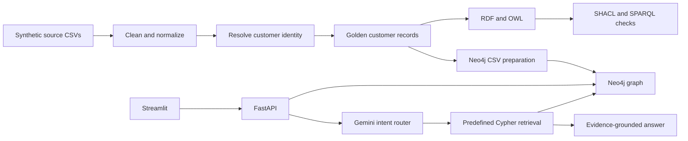

# Banking Knowledge Graph & GraphRAG

**From fragmented banking records to explainable Customer 360 and evidence-grounded answers.**

A Python portfolio project combining entity resolution, semantic modeling, graph validation, Neo4j retrieval, and a Streamlit interface. The repository demonstrates engineering decisions across the data-to-answer workflow using synthetic banking records.

**Python · pandas · RDF/OWL · SHACL · SPARQL · Neo4j · Gemini / Vertex AI · FastAPI · Streamlit**

[Architecture](docs/ARCHITECTURE.md) · [Demo walkthrough](docs/DEMO.md) · [Interview guide](docs/INTERVIEW_GUIDE.md) · [Validation](docs/VALIDATION.md) · [Security](SECURITY.md)

## What this demonstrates

| Capability | Implementation |
| --- | --- |
| Customer identity | Normalization, deterministic matching, weighted fuzzy matching, review decisions, golden records |
| Semantic governance | Banking ontology, source mappings, SHACL constraints, SPARQL quality queries |
| Graph intelligence | Customer/product relationships, shared addresses and beneficiaries, bounded connection paths |
| GraphRAG | Gemini intent routing → predefined parameterized Cypher → graph evidence → grounded response |
| Application | FastAPI customer endpoints and GraphRAG endpoint; Streamlit Customer 360 and assistant |
| Mapping research | Embedding candidates, Gemini suggestions, hybrid scores and reviewer feedback scripts |

## Architecture at a glance



RDF and Neo4j are separate materializations of the processed data. The current pipeline does not automatically gate Neo4j loading on SHACL conformance.

## Data and scope

The original dataset manifest describes **20,000 synthetic source rows**: 4,000 customers, 5,000 accounts, 3,000 cards, 2,000 loans and 6,000 transactions. In this public copy, customer names, contact details, birth dates and identity fields have been replaced with conspicuous demo values. These identity substitutions change matching behavior; they are not suitable for claiming real-world matching accuracy.

This is a portfolio prototype. Authentication, authorization, rate limiting, production deployment and measured load/latency targets are future work. Shared graph connections do not imply fraud. No production banking data or local credentials are intended for this repository.

## Quick start: offline data pipeline

Use Python 3.11 or later. Run commands from the repository root.

```bash
python -m venv .venv
# Windows PowerShell: .venv\Scripts\Activate.ps1
# macOS/Linux: source .venv/bin/activate
python -m pip install -r requirements.txt
python scripts/run_offline.py
```

The offline path cleans data, builds matching artifacts and golden customers, writes RDF, runs SHACL validation, and prepares Neo4j import files. It needs no cloud password. Generated files stay ignored by Git. A SHACL report can contain violations: inspect its conformance result rather than interpreting script completion as a quality pass.

## Run the application

1. Copy `.env.example` to `.env` and set credentials for a **dedicated demo Neo4j database**.
2. Configure a Google Cloud project with Vertex AI access and local Application Default Credentials for the Gemini calls. Keep credentials outside Git. Cloud use may incur charges.
3. Run the offline pipeline first, then load its generated files into your demo database:

```bash
python -m src.neo4j.bootstrap_cloud_graph
python -m uvicorn src.api.main:app --host 127.0.0.1 --port 8000
# In another terminal:
python -m streamlit run src/UI/app.py
```

Open the API documentation at `http://127.0.0.1:8000/docs`. The UI calls that local API. API startup verifies Neo4j connectivity; GraphRAG also needs configured Google credentials. The supplied code selects `gemini-2.5-flash`; availability depends on your cloud project.

| Endpoint | Purpose |
| --- | --- |
| `GET /health` | Database connectivity |
| `GET /customer/{customer_id}` | Customer overview |
| `GET /customer/{customer_id}/accounts` | Account details |
| `GET /customer/{customer_id}/loans` | Loan details |
| `GET /customer/{customer_id}/transactions?limit=50` | Bounded transaction listing |
| `POST /graphrag/ask` | Question, intent, answer and evidence |

## Repository map

```text
src/cleaning/           Source normalization and quality checks
src/entity_resolution/ Customer matching and golden records
src/rdf/               RDF generation and ontology loading
src/validation/        SHACL, SPARQL and ontology impact checks
src/embeddings/        Semantic mapping and review experiments
src/neo4j/             Graph preparation, loaders and enrichment
src/graphrag/          Routing, retrieval and grounded generation
src/api/               FastAPI service and request models
src/UI/                Streamlit interface
ontology/ shapes/      Semantic definitions and constraints
queries/               SPARQL and Cypher examples
scripts/               Offline pipeline runner
```

## Interview walkthrough

Start with the business problem, trace one customer through normalization and resolution, explain the two graph representations, then demonstrate an evidence-backed answer. Discuss false matches, query fan-out, model failure, access control and cost as engineering tradeoffs. See the [interview guide](docs/INTERVIEW_GUIDE.md) for a structured discussion.
