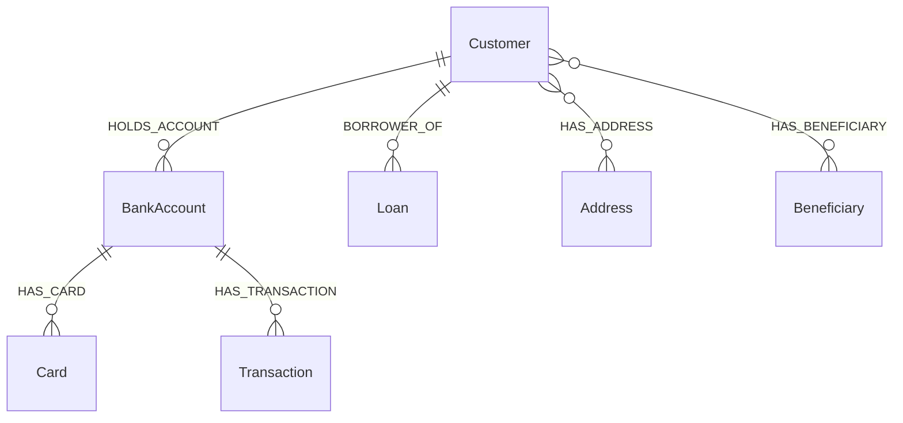

# Architecture and engineering decisions

## Data flow

The source tables model customers, accounts, cards, loans and transactions. Cleaning normalizes text, dates and categories. Entity resolution creates a perturbed external customer source, then applies deterministic and fuzzy matching. The fuzzy score weights name similarity at 40%, date-of-birth agreement at 20%, and PAN agreement at 40%. Scores at least 90 become MATCH, 75–89.99 become REVIEW, and lower scores become NO_MATCH. These are heuristic thresholds, not calibrated probabilities.

Golden customer creation is a separate script based on cleaned CRM records. Review decisions are artifacts for inspection; do not describe the current implementation as a complete master-data management merge workflow.

## Two graph representations

RDF/OWL expresses a shared banking vocabulary and supports SHACL/SPARQL validation. Neo4j supports application-oriented traversal and parameterized queries. Both derive from tabular artifacts; there is no automatic synchronization or transactional consistency between them. A production design would version input snapshots and record materialization lineage.

The network and temporal scripts extend the basic product graph. Shared address/beneficiary queries need those additional entities loaded; the baseline bootstrap alone is not a guarantee that those queries return results.

## Request flow

1. Streamlit sends an HTTP request to FastAPI.
2. Customer endpoints run predefined graph queries.
3. For GraphRAG, Gemini selects a supported intent and extracts customer identifiers.
4. The retriever selects predefined Cypher and passes identifiers as parameters.
5. The answer generator receives the question and returned graph evidence. Empty evidence produces an explicit insufficient-evidence response.
6. The API returns the question, intent, answer and evidence together.

The model does not generate executable Cypher. This limits query freedom, but does not eliminate prompt injection, model errors or unauthorized data access. The intent list is checked; identifier format and required parameters need stronger validation.

## Tradeoffs and limitations

- Multiple optional customer-product matches can multiply intermediate rows; DISTINCT reduces duplicate results but does not remove the computational cost.
- Connection-path queries cap traversal at six hops. Dense graphs still need profiling and stronger query budgets.
- Python scripts use CSV artifacts and module-level execution. This makes experimentation approachable but complicates orchestration, retries and import-safe testing.
- Neo4j drivers and Gemini clients are initialized at import time in several modules. Lazy initialization and dependency injection would improve isolated tests and startup resilience.
- Prompt instructions ask for grounded answers; they do not prove faithfulness. Evaluate answer claims against returned evidence.
- API errors can expose underlying error text. Production work includes safe error responses, identity-based authorization, TLS, observability and secret management.

## Evolution plan

Add offline service tests with injected clients; calibrate matching with a labeled holdout; enforce SHACL quality gates; introduce dataset/run versions; profile Cypher; add access control; measure retrieval accuracy, groundedness, p95 latency and cost. These are planned improvements, not implemented guarantees.
