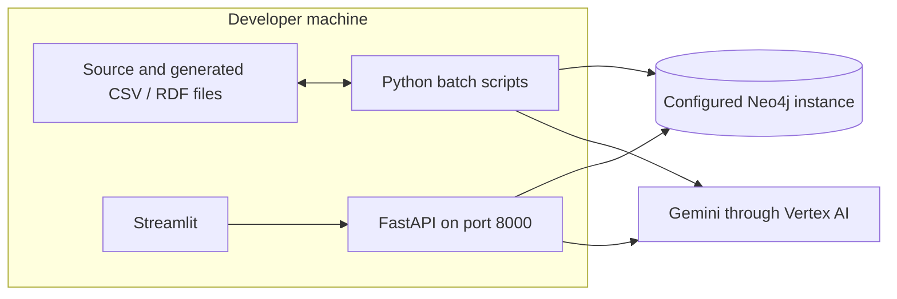

# Architecture deep dive

[README overview](../README.md#system-architecture) · [Execution runbook](WORKFLOWS.md)

Reviewed against the local project on 5 October 2026. This document describes current code boundaries and calls out proposed improvements separately.

## 1. Execution and deployment boundaries

The application is a Python repository with file-based batch jobs, an HTTP service and a browser UI. There is no implemented scheduler, queue, container deployment, infrastructure-as-code stack or background synchronization service.

The last batch-to-Vertex arrow applies to optional Gemini experiments; the offline runner does not call cloud services. Neo4j can be configured locally or remotely. The Streamlit API base URL is currently fixed to localhost. GCP/AWS libraries in requirements do not establish deployed infrastructure.

## 2. Data ownership and handoffs

| Boundary | Producer | Consumer | Contract |
| --- | --- | --- | --- |
| Raw → clean | Source CSV files | Cleaning scripts | Expected column names and parseable values |
| Clean → identity | Cleaning and external fixture generation | Normalization/matching scripts | CRM and external IDs plus comparable identity fields |
| CRM → golden | Normalized CRM | Golden-customer script | Sorted CRM rows with sequential golden IDs |
| Golden → semantic graph | Golden and cleaned product files | RDF generator | Banking vocabulary, typed values and ownership links |
| Golden → property graph | Golden and cleaned product files | Neo4j preparation | Node IDs and relationship endpoint IDs |
| CSV → Neo4j | Node/relationship tables | Batch loaders | Parameterized row batches and matching endpoints |
| Question → intent | API request | Gemini router | Supported intent plus extracted identifiers |
| Intent → evidence | Router output | Graph retriever | Fixed query selected by intent; parameters bound separately |
| Evidence → answer | Neo4j result dictionaries | Answer generator | Serialized graph facts, question and grounding instructions |

The RDF generator and Neo4j preparation independently map CRM references to golden identifiers. They do not read from each other's databases. No global transaction ties all CSVs, RDF and Neo4j together. A production pipeline would attach input versions and run IDs to every artifact.

## 3. Identity resolution is an experiment boundary

Exact matching scores PAN/phone/email at 50/30/20. Fuzzy matching blocks on city and weights name/DOB/PAN at 40/20/40, then applies 90 and 75 cutoffs. These paths write separate artifacts. Neither the deterministic output nor the review decisions are consumed by golden creation.

Golden creation assigns sequential IDs to sorted normalized CRM records. It preserves one row per CRM row instead of implementing cross-source survivorship. A complete identity service would add persistent IDs, ambiguity handling, reviewer audit, merge/unmerge operations and field-level provenance. City blocking and demo identity substitutions limit conclusions about recall or precision.

## 4. Semantic model and quality layer

OWL vocabulary, RDF generation and SHACL constraints serve distinct roles. Vocabulary defines terms; generation assigns instance facts; shapes check required fields, datatypes, value ranges and relationships. SHACL uses inverse paths where needed to validate incoming ownership links.

RDF and Neo4j vocabulary names are not identical. Examples include RDF `linkedCard` versus Neo4j `HAS_CARD`, and RDF `maintainedAt` versus Neo4j `MAINTAINED_AT`. The source-to-canonical CSV is reference metadata; transformation scripts contain explicit mappings.

SPARQL combines defect detection with business exploration. Counts must be interpreted by query purpose. SHACL writes conformance reports but currently does not fail the pipeline on nonconformance. A real publication gate should define blocking shapes and severity policies.

## 5. Operational graph and loader semantics

Core nodes are Customer, BankAccount, Card, Loan, Transaction and Branch. Network extensions add Address and Beneficiary. Temporal extensions add Organization. The README graph diagram shows edge direction.

Bootstrap verifies the connection, creates uniqueness constraints, and sends batches of 500 rows via UNWIND. MERGE identifies existing nodes/relationships; SET updates properties. This makes repeated identifier-based imports practical, but does not reconcile deleted records or guarantee an atomic whole-dataset refresh.

The bootstrap conditionally loads addresses/beneficiaries and skips absent relationship files. Organization data uses its own loader. Enrichment CSVs contain sourceSystem, confidence, validFrom, blank validTo, ingestedAt and recordVersion. The enriched relationship loader persists these fields except validTo. The separate temporal organization loader sets its validTo explicitly. These are generated examples, not complete temporal lineage.

Customer-organization relationships include role and validFrom in the MERGE pattern. The system is not a general bitemporal database. GraphRAG's connection path does not filter those dates or confidence scores.

## 6. GraphRAG component contracts

| Component | File | Responsibility |
| --- | --- | --- |
| HTTP entry | `src/api/main.py` | Request validation, routes and status handling |
| Orchestration | `src/api/graphrag_service.py` | Route → retrieve → answer, with UNKNOWN short-circuit |
| Router | `src/graphrag/query_router.py` | Gemini JSON intent and identifier extraction |
| Retriever | `src/graphrag/graph_retriever.py` | Predefined parameterized Cypher catalog |
| Generator | `src/graphrag/answer_generator.py` | Evidence-only prompt or fixed empty-evidence response |
| Presentation | `src/UI/app.py` | Pages, HTTP calls and evidence display |

A supported question with nonempty evidence normally causes two Gemini calls: routing and answering. UNKNOWN stops after routing. Empty evidence still needs routing but skips generation. Exact usage depends on failures and user actions; no cost benchmark has been recorded.

The router requests JSON and validates the intent list. It does not implement a strict typed schema for customer IDs. The retriever does not execute model-generated Cypher. Parameterization limits query-injection risk but does not provide data authorization or protect against every prompt-manipulation failure.

For empty evidence, the generator emits an explicit insufficient-evidence message. For nonempty evidence, prompt instructions require grounded statements, identifiers where available and no unsupported fraud implication. These instructions are not a mathematical or tested guarantee of faithfulness.

## 7. API and resource lifecycle

FastAPI validates question length (3–500) and transaction limits (1–200). The health route maps database failures to 503; absent customer overview maps to 404. Generic GraphRAG exceptions become 500. Existing error details can contain underlying exception text and should be sanitized for production.

The API database driver is closed during lifespan shutdown. The retriever creates a separate driver, and Google clients initialize at module import. This creates tighter startup/test coupling and incomplete unified cleanup. Dependency injection and lazy client creation are natural next improvements.

There is no authentication, customer-scoped authorization, rate limiting, retry policy or end-to-end observability layer in the application. A local working demonstration must not be described as an externally secured service.

## 8. Mapping governance is a separate loop

Normalized MiniLM embeddings retrieve the top three ontology concepts. Gemini proposals, aliases and compatibility checks feed a weighted hybrid score. Alias-first concept selection can differ from the top candidate whose embedding score enters the formula. Gemini confidence is self-reported rather than calibrated.

Review routing creates CSV queues; completed APPROVE/CORRECT_MAPPING entries update aliases. AUTO_APPROVE is a label, not an ontology migration. Collision and gap proposals need manual review. A production loop needs concept validation, audit history, concurrency controls, schema versioning and feedback evaluation.

## 9. Performance and reliability tradeoffs

- Customer queries use multiple OPTIONAL MATCH clauses. DISTINCT reduces duplicate output, but intermediate combinations can still multiply; profile cardinality before claiming scale.
- Six-hop shortest paths bound length, not total search effort in a dense graph.
- Loading batches reduces request overhead, but scripts do not offer resumable checkpoints or cross-stage transactions.
- Golden IDs depend on row ordering. Persist a stable source-to-master mapping for incremental updates.
- Client creation during import complicates isolated tests and can make startup fail before a user invokes GraphRAG.
- Dependencies are not locked; CI and local environments may resolve different package versions.

## 10. Validation boundary and evolution

The recorded offline run produced 181,165 RDF triples with SHACL conformance. Seven isolated API tests cover route contracts using mocks. These checks do not measure cloud connectivity, answer faithfulness, real-world identity matching or production throughput. See [VALIDATION.md](VALIDATION.md) for the dated evidence.

Suggested implementation order: inject clients and strengthen tests; stabilize IDs and reviewed merges; version datasets and enforce quality gates; add authorization and safe errors; benchmark graph retrieval; evaluate intent accuracy and groundedness; then add orchestration, monitoring and deployment controls.
